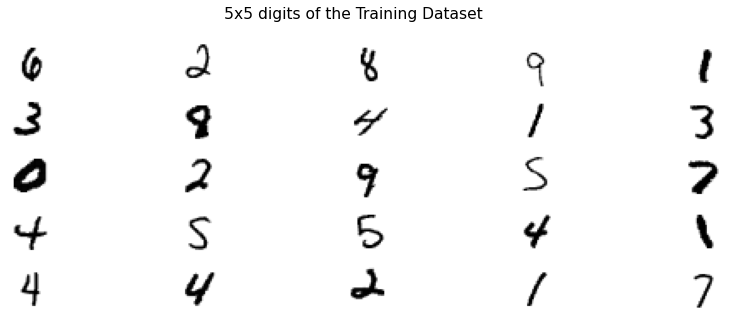

# Multiple Class Classifier

A Notebook that apply ML models on MNIST dataset.

For acces online this Jupyter Notebook click here <a href="Multiple Class Classifier - MNIST Dataset.ipynb">link</a> or
[[!Binder](https://mybinder.org/badge_logo.svg)](https://mybinder.org/v2/gh/msc2020/ml-multiclassifier-mnist/HEAD?labpath=Multiple Class Classifier - MNIST Dataset.ipynb)

## Summary of Jupyter Notebook:
#### 1. Dataset
#### 2. Multiclass classification
#### 3. Neural Network Models
#### 4. Results
#### 5. Save/Load the model
#### 6. Read a handwritten digit image PNG and make a prediction
#### 7. Next steps
#### References

 

  

 